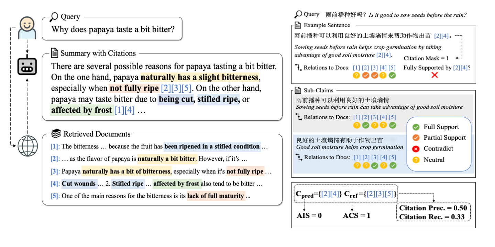

# WebCiteS: Attributed Query-Focused Summarization on Chinese Web Search Results with Citations
[[中文版]](README_zh.md)

This repository contains the code associated with the paper [WebCiteS: Attributed Query-Focused Summarization on Chinese Web Search Results with Citations](https://arxiv.org/abs/2403.01774). In this work, we formulate the task of attributed query-focused summarization (AQFS) and present WebCiteS, a Chinese dataset featuring 7k human-annotated summaries with citations. WebCiteS derives from real-world user queries and web search results, offering a valuable resource for model training and evaluation. We adopt comprehensive evaluation metrics on summarization utility and attribution and develop an cost-effective automatic evaluator based on open-source models for scalable and robust evaluation. Please refer to the paper for more details.



## News
- (2024.5) WebCiteS is accepted to ACL 2024 main conference. 🎉

## Contents
- [Setup](#setup)
- [Prepare the Evaluator](#prepare-the-evaluator)
- [Experiments on the AQFS task](#experiments-on-the-aqfs-task)

## Setup
Clone the repository and navigate to the root directory.
```bash
git clone https://github.com/HarlynDN/WebCiteS.git
cd WebCiteS
```
### Install the requirements
```bash
pip install -r requirements.txt
```

### Data preparation
Run the following command to download and preprocess the dataset.
```bash
wget https://huggingface.co/datasets/HarlynDN/WebCiteS/resolve/main/data.tar
tar -xvf data.tar
echo "deleting tar file"
rm data.tar
cd data
echo "preprocessing the data"
python prepare_data.py --raw_data webcites.json
cd ..
```

## Prepare the Evaluator

### Train the claim-split model
The claim-split model receives a sentence and generates a list of its sub-claims. Here we fine-tune the `google/mt5-large` model on this task.
```bash
cd src
NUM_GPUs=8
torchrun --standalone --nnodes=1 --nproc-per-node=$NUM_GPUs claimsplit/main.py \
    --do_train \
    --do_eval \
    --do_predict \
    --data_dir ../data/claimsplit \
    --source_column sentence \
    --target_column claims \
    --overwrite_cache \
    --model_name_or_path google/mt5-large \
    --output_dir {path/to/output/directory} \
    --overwrite_output_dir \
    --max_source_length 64 \
    --max_target_length 128 \
    --per_device_train_batch_size 8 \
    --num_train_epochs 5 \
    --learning_rate 1e-4 \
    --logging_steps 10 \
    --evaluation_strategy epoch \
    --save_strategy epoch \
    --predict_with_generate 
```


### Evaluate the claim-split model
We use an NLI model to evaluate the redundancy, correctness, and completeness of the generated sub-claims against their source sentences. Here we use the `alan-turing-institute/mt5-large-finetuned-mnli-xtreme-xnli` model as the NLI model.

```bash
cd src
python claimsplit/eval.py \
    --f {path/to/claimsplit/generation/file} \
    --nli_model alan-turing-institute/mt5-large-finetuned-mnli-xtreme-xnli \
    --batch_size 256
```
If you are hitting OOM, try to reduce `batch_size`.

### Evaluate the whole evaluator
We evaluate the performance of the evaluator consisting of a claim-split model and an NLI model on the test set of WebCiteS.
```bash
cd src
python aqfs/eval_evaluator.py \
    --f ../data/aqfs_snippet/test.json \
    --nli_model alan-turing-institute/mt5-large-finetuned-mnli-xtreme-xnli \
    --claimsplit_model {path/to/the/fine-tuned/claimsplit/model/checkpoint} \
    --nli_batch_size 256 \
    --claimsplit_batch_size 512 
``` 
If you are hitting OOM, try to reduce `nli_batch_size` and `claimsplit_batch_size`.

## Experiments on the AQFS task

### Supervised fine-tuning
We use the [deepspeed library](https://github.com/microsoft/DeepSpeed) for LLM fine-tuning. The configuration file is `src/deepspeed.json`. 
Here is an example of fine-tuning the `THUDM/chatglm3` model on this task.
```bash
cd src
deepspeed --num_gpus=8 aqfs/main.py \
    --deepspeed deepspeed.json \
    --do_train \
    --data_dir ../data/aqfs_snippet \
    --source_column prompt \
    --target_column summary \
    --overwrite_cache \
    --model_name_or_path THUDM/chatglm3-6b \
    --output_dir {path/to/output/directory} \
    --overwrite_output_dir \
    --max_source_length 1280 \
    --max_target_length 400 \
    --per_device_train_batch_size 1 \
    --gradient_accumulation_steps 8 \
    --gradient_checkpointing \
    --num_train_epochs 1 \
    --save_strategy epoch \
    --logging_steps 2 \
    --learning_rate 2e-5 \
    --fp16
```
We tested the above command on 8 A100-40GB GPUs. However, you might be able to run the code with less computational resources by enabling CPU offloading. See this [tutorial](https://huggingface.co/docs/transformers/v4.38.2/deepspeed) for more details.

### Inference
Here is an example of inference using the fine-tuned model.
```bash
cd src
NUM_GPUs=8
torchrun --standalone --nnodes=1 --nproc-per-node=$NUM_GPUs aqfs/main.py \
    --do_predict \
    --data_dir ../data/aqfs_snippet \
    --source_column prompt \
    --target_column summary \
    --overwrite_cache \
    --model_name_or_path {path/to/the/model/checkpoint} \
    --output_dir {path/to/output/directory} \
    --overwrite_output_dir \
    --max_source_length 1280 \
    --max_target_length 400 \
    --per_device_eval_batch_size 1 \
    --predict_with_generate 
```
The above command executes the data-paralleled inference, where each GPU loads the entire weights of the model and processes a mini-batch of data. We aslo provide the script for model-parallel inference, where the weights of model are sharded across multiple GPUs. If you are hitting OOM when running the above command, try the following command. 
```bash
python aqfs/inference.py --{same arguments as above}
```

#### Few-shot prompting
Here is an example of few-shot prompting.
```bash
cd src
NUM_GPUs=8
torchrun --standalone --nnodes=1 --nproc-per-node=$NUM_GPUs aqfs/main.py \
    --do_predict \
    --use_chat_format \
    --data_dir ../data/aqfs_snippet \
    --source_column prompt \
    --target_column summary \
    --exemplar_id a18f3958-3d98-4e1a-bca6-d8c83712ec64 \
    --overwrite_cache \
    --model_name_or_path THUDM/chatglm3-6b \
    --output_dir {path/to/output/directory} \
    --overwrite_output_dir \
    --max_source_length 3680 \
    --max_target_length 400 \
    --per_device_eval_batch_size 1 \
    --predict_with_generate 
```
There are two additional arguments `--use_chat_format` and `--exemplar_id` in the above command. Similarly, use `aqfs/inference.py` for model-parallel inference.

#### Long-Context setting
In the long-context setting, models are provided with full content of web pages to summarize. To adopt this setting, set `--data_dir` to `../data/aqfs_full_chunk256` or `../data/aqfs_full_chunk512`, and set `--max_source_length` to 7680.

### Evaluation
We use the evaluator for automatic evaluation. Here is an example of evaluating the AQFS outputs.
```bash
cd src
python aqfs/eval.py \
    --f {path/to/model/outputs} \
    --nli_model alan-turing-institute/mt5-large-finetuned-mnli-xtreme-xnli \
    --claimsplit_model {path/to/the/fine-tuned/claimsplit/model/checkpoint} \
    --nli_batch_size 256 \
    --claimsplit_batch_size 512 
```
If you are hitting OOM, try to reduce `nli_batch_size` and `claimsplit_batch_size`.

### ChatGPT outputs
Run the folowing command to download outputs from GPT-3.5 and GPT-4.
```bash
wget https://huggingface.co/datasets/HarlynDN/WebCiteS/resolve/main/gpt_outputs.tar
tar -xvf gpt_outputs.tar
echo "deleting tar file"
rm gpt_outputs.tar
```

## Citation
If you find this work helpful, please consider citing our paper.
```bibtex
@misc{deng2024webcites,
      title={WebCiteS: Attributed Query-Focused Summarization on Chinese Web Search Results with Citations}, 
      author={Haolin Deng and Chang Wang and Xin Li and Dezhang Yuan and Junlang Zhan and Tianhua Zhou and Jin Ma and Jun Gao and Ruifeng Xu},
      year={2024},
      eprint={2403.01774},
      archivePrefix={arXiv},
      primaryClass={cs.CL}
}
```